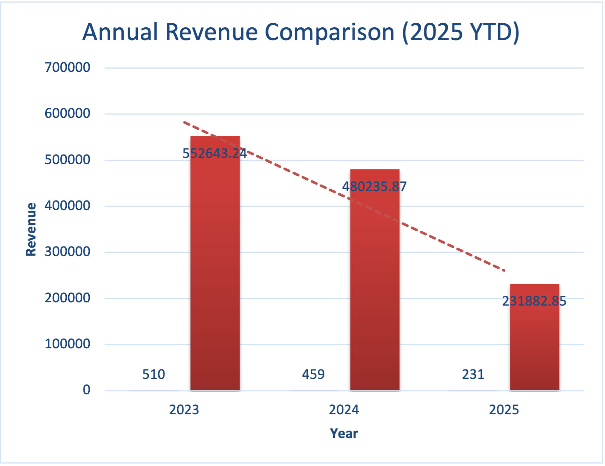
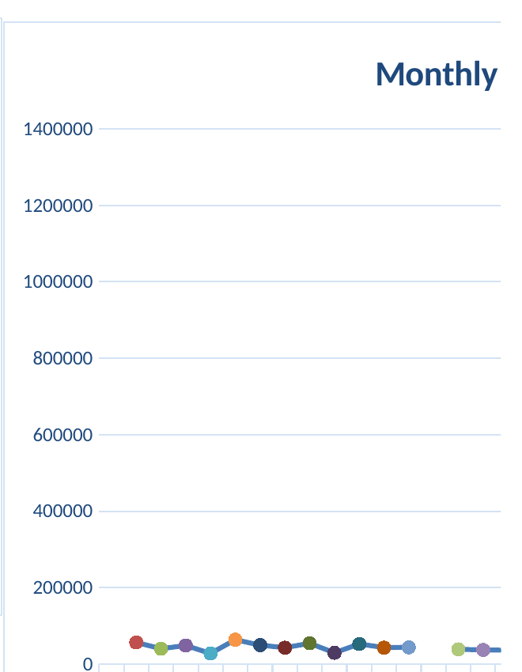

# Project 2 — Business Sales Analysis & Data Visualization

## Project Overview

This project focused on analyzing business sales data to identify patterns in sales performance, product performance, order behavior, and revenue trends.

Building on the cleaned dataset from Project 1, the analysis involved using Excel to perform descriptive and business-focused analysis, calculate key metrics, identify trends and outliers, and communicate findings through visualizations.

The goal was to transform transactional sales data into meaningful business insights that could support data-driven decision-making.

---

## Objectives

The analysis focused on:

- Understanding overall sales and order performance
- Comparing product performance
- Examining customer purchasing behavior
- Analyzing revenue trends across years
- Identifying monthly revenue patterns
- Measuring the distribution of key sales variables
- Identifying potential high-value outliers
- Communicating findings through appropriate visualizations
- Translating analytical results into business insights

---

## Analysis Performed

### 1. Order & Customer Behavior

The analysis examined purchasing behavior using metrics such as:

- Average quantity purchased per order
- Median quantity purchased per order
- Average number of items in the cart
- Median number of items in the cart

Customers purchased an average of **2.95 units per order**, with a median of **3 units**.

The average number of items in the cart was **5.49**, with a median of **5**, indicating relatively consistent purchasing behavior.

---

### 2. Product Performance

Product performance was evaluated using:

- Number of orders by product
- Total revenue by product
- Average order value by product

Order volumes were relatively evenly distributed across products.

**Printers** recorded the highest number of orders with **181 orders**, while **phones** recorded the lowest with **156 orders**.

In terms of total revenue, **chairs generated the highest revenue at $195,620.11**, while **phones generated the lowest at $151,722.39**.

**Laptops** recorded the highest average order value at **$1,110.56**.

---

### 3. Overall Revenue Performance

The analysis examined revenue performance across the years represented in the dataset.

Revenue decreased from **$552,643.24 in 2023** to **$480,235.87 in 2024**. This was accompanied by a decrease in the number of orders from **510 to 459**.

The 2025 dataset only covers **January–June**, so 2025 was treated as **year-to-date (YTD)** rather than being compared with the full-year figures for 2023 and 2024.

---

## Visualizations

### Annual Revenue Comparison (2025 YTD)

This bar chart compares annual revenue performance while treating 2025 as year-to-date because the available data only covers January through June.

**Insight:**

Revenue declined from 2023 to 2024, while the 2025 figure represents only the first six months of the year and therefore should not be interpreted as a full-year result.

---

### Monthly Revenue

This line chart shows how revenue fluctuated across the months represented in the dataset.

**Insight:**

Revenue varied considerably across months. June was among the stronger-performing months in each year represented, while some months, including April 2023 and May 2024, recorded substantially lower revenue.

---

## Descriptive Statistics & Distribution Analysis

Descriptive statistics were calculated for key numerical variables, including:

- Quantity
- Unit Price
- Items in Cart
- Total Price

The analysis included:

- Count
- Mean
- Median
- Minimum
- Maximum
- Standard deviation

This provided an understanding of the central tendency, spread, and overall distribution of the sales data.

### Total Price Analysis

The `TotalPrice` variable had a mean of **$1,053.97** compared with a median of **$823.62**.

The difference between the mean and median indicates that higher-value transactions influenced the overall average.

---

## Outlier Analysis

The Interquartile Range (IQR) method was used to identify unusually high transaction values.

The analysis established an upper threshold of **$3,330.41**.

A total of **8 orders**, representing approximately **0.67% of the dataset**, were identified as high-value outliers above this threshold.

These transactions were retained as part of the analysis because they may represent legitimate high-value purchases rather than data errors.

---

## Key Business Insights

The analysis produced several important findings:

- Purchasing behavior was relatively consistent, with customers purchasing an average of 2.95 units per order.
- Product order volumes were relatively evenly distributed.
- Printers had the highest number of orders, while phones had the lowest.
- Chairs generated the highest total revenue despite not having the highest order volume.
- Laptops had the highest average order value.
- Revenue declined between 2023 and 2024 alongside a decline in order volume.
- 2025 should be interpreted as a year-to-date period because only January–June data was available.
- Monthly revenue showed considerable variation, with June performing strongly across the years represented.
- A small proportion of transactions were identified as high-value outliers.

---

## Tools Used

- **Microsoft Excel** — data analysis, calculations, statistical analysis, and visualization

---

## Skills Demonstrated

### Data Analysis

- Exploratory data analysis
- Descriptive statistics
- Sales analysis
- Product performance analysis
- Customer purchasing behavior analysis
- Revenue analysis
- Trend analysis
- Comparative analysis
- Distribution analysis
- Outlier detection using the IQR method

### Data Visualization

- Chart selection
- Bar chart creation
- Line chart creation
- Trend visualization
- Comparative visualization
- Data storytelling

### Business Analysis

- Translating data into business insights
- Identifying performance patterns
- Interpreting sales trends
- Evaluating product performance
- Identifying potential areas of business concern
- Supporting data-driven decision-making
- Communicating analytical findings

### Technical Skills

- Microsoft Excel
- Excel formulas
- Statistical calculations
- Data aggregation
- Data summarization
- Data visualization

---

## Project Outcome

This project demonstrated the process of transforming cleaned transactional sales data into meaningful business information.

The analysis combined descriptive statistics, product and revenue analysis, trend analysis, outlier detection, and data visualization to provide a clearer understanding of business performance.

The findings can be used to support decisions around product performance, sales monitoring, revenue trends, and further investigation of high-value transactions.

---

## Project Files

| File | Description |
|------|-------------|
| `Project_2_Business_Analysis.xlsx` | Complete Excel workbook containing the analysis, calculations, visualizations, and supporting insights |
| `visuals/annual-revenue-comparison.png` | Annual revenue comparison visualization |
| `visuals/monthly-revenue.png` | Monthly revenue trend visualization |
